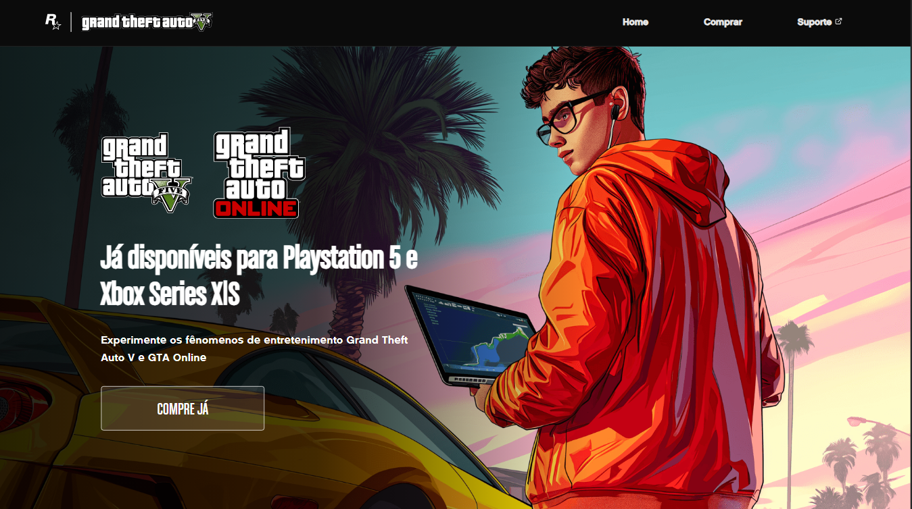
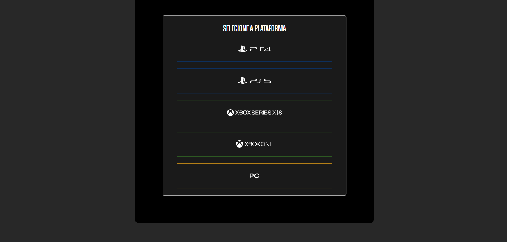

# <h1 align="center"> [GTA V – Landing Page](https://catarinaeudoxia.github.io/projeto-gta/) </h1>

  

## Índice

* [1. Introdução](#1-introdução)
* [2. Sobre o projeto](#2-sobre-o-projeto)
* [3. Objetivos](#3-objetivos)
* [4. Resultado](#4-resultado)
* [5. Ferramentas e Mecanismos usados:](#5-ferramentas-e-mecanismos-usados)
* [6. Landing page aqui:](#6-landing-page-aqui)

 

## 1. Introdução

Bem-vindo ao repositório da Landing Page do GTA V! Este projeto foi desenvolvido como parte da jornada de treinamento "Do Zero ao Programador Contratado", ministrada pela Dev em Dobro. Durante esta jornada intensiva, que totalizou 10 horas de carga horária, exploramos e aplicamos conceitos fundamentais de HTML, CSS e JavaScript para criar uma página de destino inspirada no jogo GTA V.

 

## 2. Sobre o Projeto

A Landing Page do GTA V é uma representação visualmente atrativa do universo do jogo Grand Theft Auto V. Utilizando HTML para estruturar o conteúdo, CSS para estilização e JavaScript para funcionalidades dinâmicas, buscamos recriar a essência e a atmosfera do jogo nesta página única.

 

## 3. Objetivos

O principal objetivo deste projeto foi aplicar os conhecimentos adquiridos durante o treinamento de forma prática e tangível. Através da criação desta Landing Page, buscamos consolidar nossa compreensão sobre as tecnologias web fundamentais e sua aplicação na construção de interfaces de usuário interativas e envolventes.

 

## 4. Resultado

  

  

  

 

## 5. Ferramentas e Mecanismos usados:

— HTML

— CSS

— JavaScript

— VSCODE

— Git 

 

# 6. Landing page aqui:

### Aproveite e de uma olhadinha no projeto [GTA V - Landing page](https://catarinaeudoxia.github.io/projeto-gta/)! 

  

 

